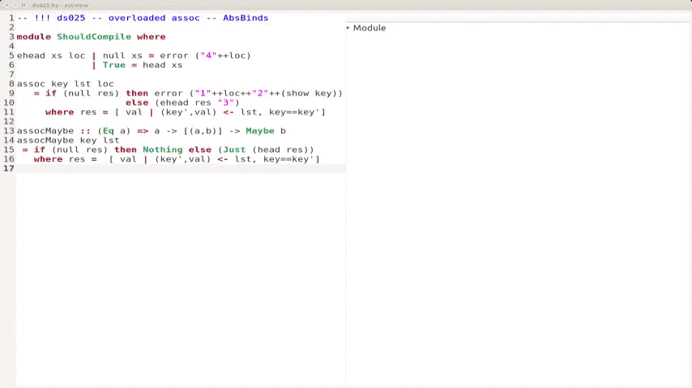

# Astview - Documentation [](https://travis-ci.org/pascalh/Astview)

Astview (short for "abstract syntax tree view") is a little desktop program to be used by people that want
to investigate syntax trees, e.g. students and lecturers in compiler
construction courses.
The program evolved as a case study in datatype-generic programming and
building graphical user interfaces in Haskell.



Astview is under continuous development. The sources can be found at [Github](https://github.com/pascalh/Astview). 

Developer documentation is located in the [wiki](https://github.com/pascalh/Astview/wiki/Deveoloper-guide).

## User guide

### Installing astview

First of all download the sources of astview, which can be easily achieved by  

```Bash
git clone https://github.com/pascalh/Astview
```

To install astview, just run `stack install` in the astview-directory.

### Using Astview

You can open astview directly with a file by giving the filename at the command line:

```Bash
astview path/to/mysource.hs
```
or simply start `astview` without arguments and open a file directly via the file menu.

#### Basic text editor functionality

The menu file offers the functionality to work with files.
Saving a edited file works as usual: Ctrl-S saves, Save-As has to be done via the menu.
After changing a file in astviews source editor, a star appears in the title bar next to the
filename to indicate that the file has been changed.

Cut-and-Paste functionality works as usual (Ctrl-C/V/X), allowing to copy-paste source code around.
The correspondent menu items can be found in menu `Edit`. You can use Ctrl-P to reparse the source code and refresh the tree (the shortcut is not displayed in the menu but works anyway).

#### Language and parser selection

Astview can be easily extended by new languages (see [dev documentation](https://github.com/pascalh/Astview/wiki/Deveoloper-guide)). Every language
can be associated with file extensions, which for example enables astview to directly apply the parser for
Haskell if a file with extension ```hs``` is being opened. This automatic
parser selection can be turned off by selecting a specific parser
in the menu ```Language```.

#### Source location specific functionality

If the current language supports source locations, one can jump from a selected text position in the source editor to the associated position in the abstract syntax tree by clicking on `Navigate/>>>`.

The menu entry `Navigate/<<<` highlights the corresponding interval in the source editor for the recently selected subtree.

#### Flattening lists

One note on the representation of Haskells lists in the tree: By default lists in the abstract syntax tree are flattened, which means that they are displayed as a `n`-ary tuple where `n` is the length of the list. If you like to see the exact Haskell term displayed in the tree view with all of its nested applications of the cons operator, you can disable flattening in menu `Edit`.
